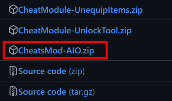
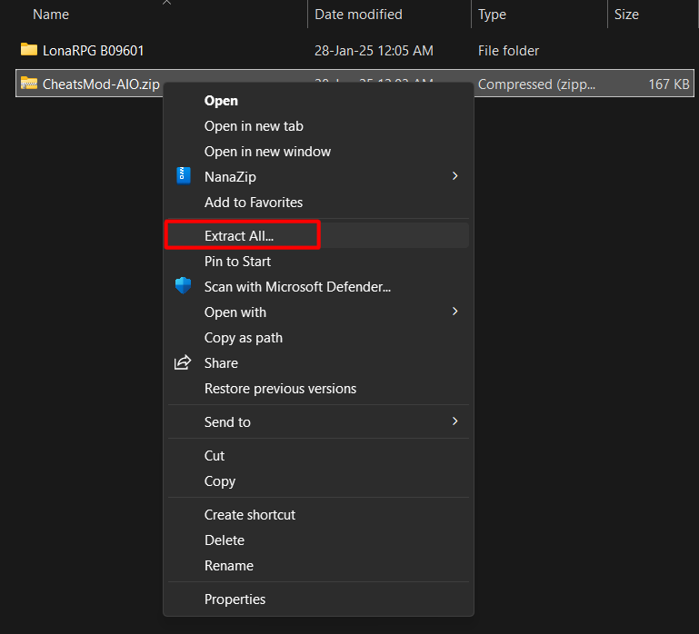
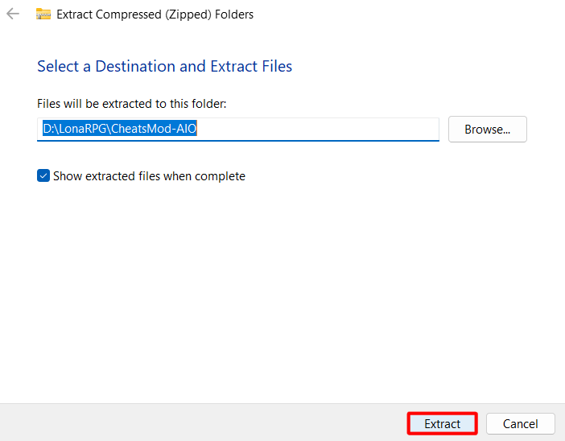
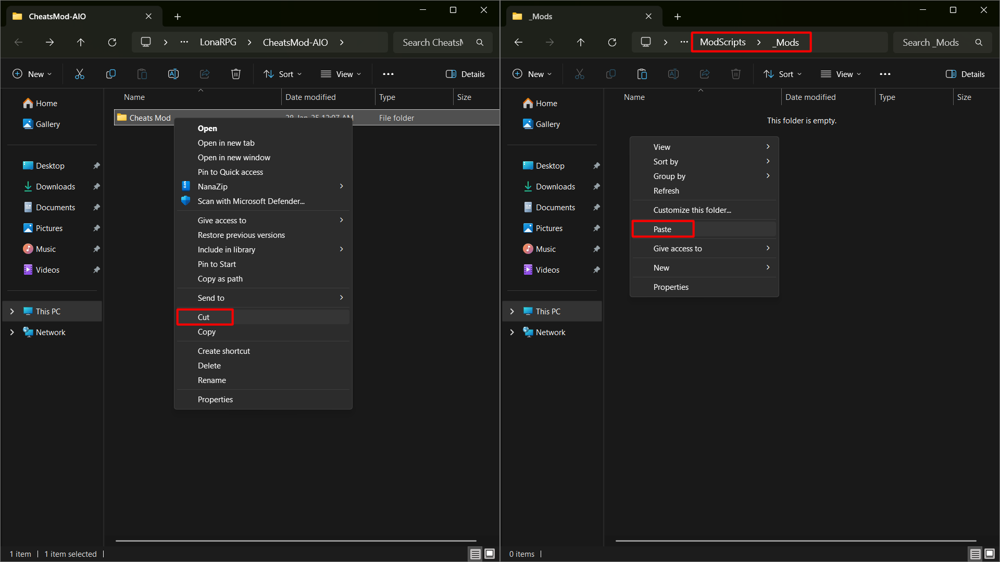
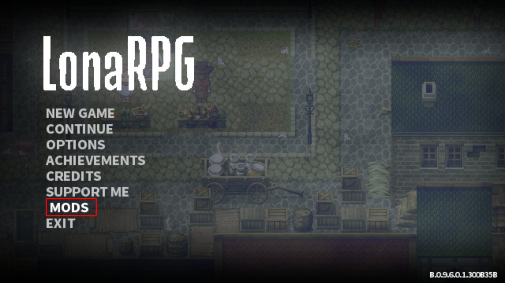
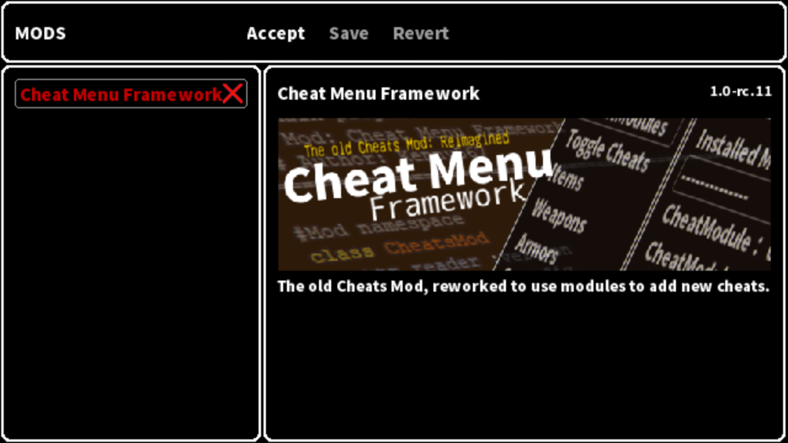
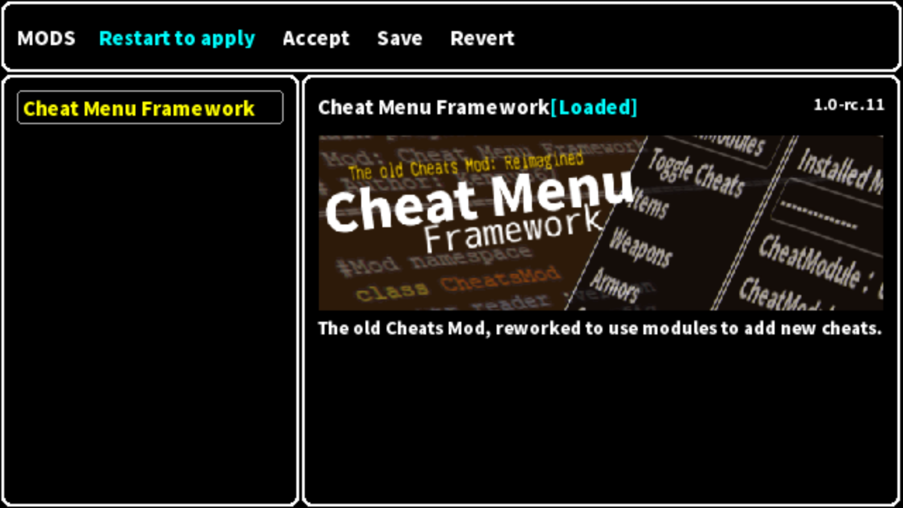
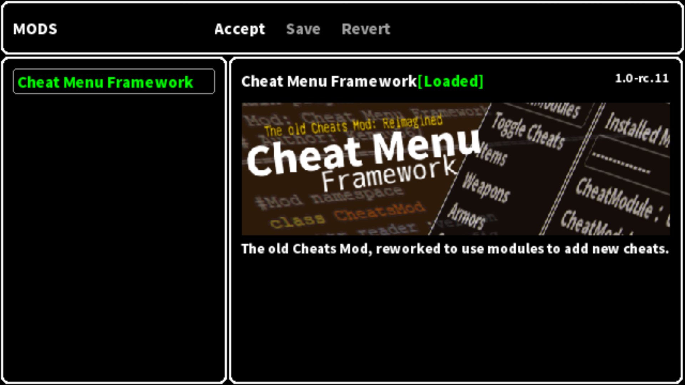

# LonaRPG Modding Guide

Some basics:
- Mods may conflict with each other. If a mod doesn't work, try disabling all other mods and restarting the game.

- Game updates may break mods. Wait for the mod update when that happens (if the mod is not maintained, you are on your own).

- Don't update the mod (or game) by copying and overwriting files. Delete the old one and install the new one. Migrate any personal configs and saves.

# How to Install
1. Download the mod from the [release page](https://github.com/K3nny567/Cheat-Menu-Framework/releases/latest). The AIO includes most cheats.

    

2. Extract the mod. There are many programs you can use for this, but I will be using File Explorer as it is included with Windows.

    - Left-click the downloaded file, right-click it, and select `Extract All...`

        

    - Select `Extract` on the popped-up window.

        

3. A new window should open showing a folder named `Cheats Mods`. Move that folder to the game's `ModScripts\_Mods` folder.
    

4. Open `Game.exe`. After it finishes loading, use the arrow keys to navigate to `MODS` and press `Z`.
    
    - The mod name is red, which means it is disabled. Navigate to the mod and press `Z` to enable it.
        

    - The mod name is yellow, which means it is enabled but not started. Navigate to the `Accept` button and restart the game.
        

    - The mod name is green, which means it is enabled and started.
        

5. Now, when you are in a save, press F9, and the Cheat Menu will show up. Note that on some keyboards, the F9 key has an alternate function, which may require you to press Fn Lock to switch.
    [F9 menu](LonaRPG-Modding-Guide.md)

# Extra Resources
- https://f95zone.to/posts/14202674
- https://f95zone.to/posts/9588500
