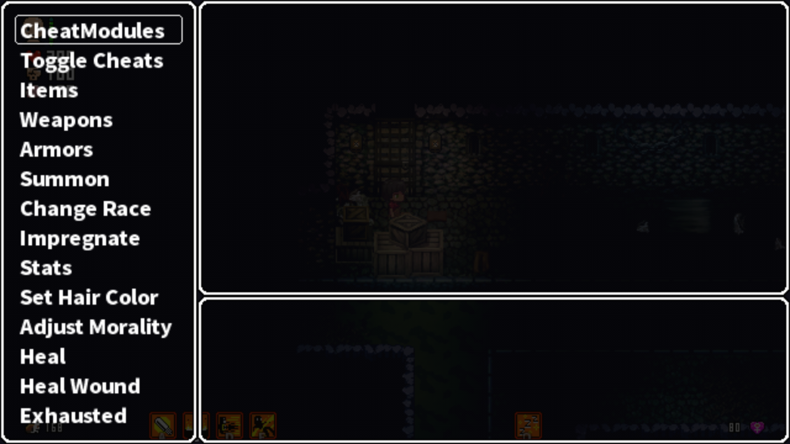

# LonaRPG Modding Guide
Some Basics:
- Mods may conflict with each other. If a mod doesn't work, try disabling all other mods and restarting the game.

- Game updates may break mods. Wait for the mod update when that happens. If the mod is not maintained, you are on your own.

- Don't update the mod (or game) by copying and overwriting files. Delete the old one and install the new one. Migrate any configs and saves.

# How to Install
1. Download the mod from the [release page](https://github.com/K3nny567/Cheat-Menu-Framework/releases/latest). The AIO includes most cheats.

    

2. Extract the mod. There are many programs you can use for this, but I will be using File Explorer as it is included with Windows.

    - Left-click the downloaded file, right-click it, and select `Extract All...`

        

    - Select `Extract` in the pop-up window.

        

3. A new window should open showing a folder named `Cheats Mods`. Move that folder to the game's `ModScripts\_Mods` folder.

    

4. Open `Game.exe`. After it finishes loading, use the arrow keys to navigate to `MODS` and press `Z`.

    

    - When the mod name is ${\color{red}red}$, it is disabled. Navigate to the mod and press `Z` to enable it.

        

    - When the mod name is ${\color{yellow}yellow}$, it is enabled but not running. Navigate to the `Accept` button, press `Z`, and restart the game.

        

    - When the mod name is ${\color{green}green}$, it is enabled and running.

        

5. Now, when you are in a save, press `F9`, and the Cheat Menu will show up.

    

> [!NOTE]
> On some keyboards, the `F9` key has an alternate function, which may require you to press the `Fn Lock` key to switch.

# Extra Resources
- https://f95zone.to/posts/14202674
- https://f95zone.to/posts/9588500